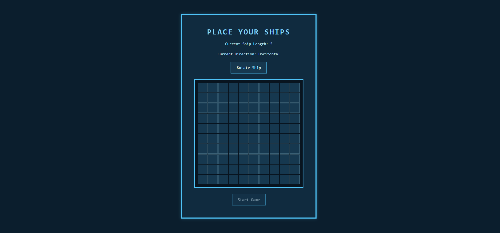
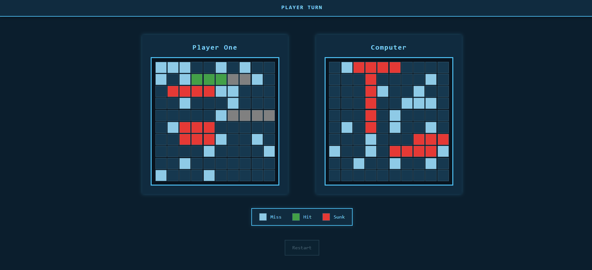
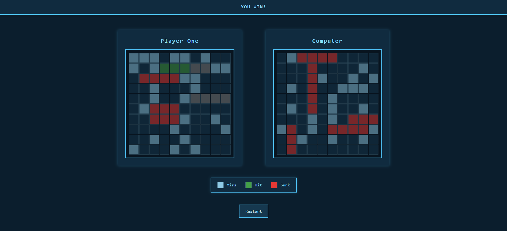

# Battleship

Classic Battleship game built with Vanilla JavaScript as part of The Odin Project curriculum.

## Features

- Randomized enemy ship placement
- Drag and drop ship placement
- Turn-based attack system
- Hit/miss indicators
- Responsive retro UI

## Tech Stack

- JavaScript
- HTML
- CSS
- Webpack
- Jest

## Live Demo

[Live Demo](https://midhin11.github.io/battleship/)

## Screenshots

  

  

  

